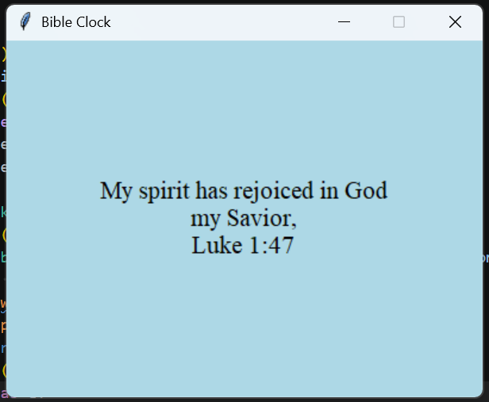

# Bible Clock
Bible Clock displays a Bible verse that changes every minute.
The address of the Bible verse is the same as the time!

For example, if it was 3:16, the clock could say "For God so loved the world that He gave His only son that whoever believes in Him shall not perish but have eternal life. John 3:16"

***This project takes Bible verses out of context. This means that the text displayed on the clock may not always make sense and can even seem to say the opposite of what the Bible teaches.*
READ THE VERSES IN CONTEXT TO UNDERSTAND WHAT IT REALLY MEANS!**

## Quickstart

See the [releases page](https://github.com/Abracadabra3/bible_clock/releases/tag/1.0) to download and run the program!

## Features

- Popup window displaying Bible verses
- Bible verse changes on the minute
- Text centered in the window
- Window stays open and on top to make seeing the clock easy

## Design decisions

This is my first time using Tkinter to make a GUI! I struggled with updating the GUI and waiting for the minute because using time.sleep() would freeze the GUI. The code I was originally using to wait for the minute would make the GUI not close until the minute changed.

## Credits

I used an AI to help troubleshoot Tkinter issues with the GUI.

This project was created for [Stardance](stardance.space/go), a free program for teens to create technical projects and get prizes.
